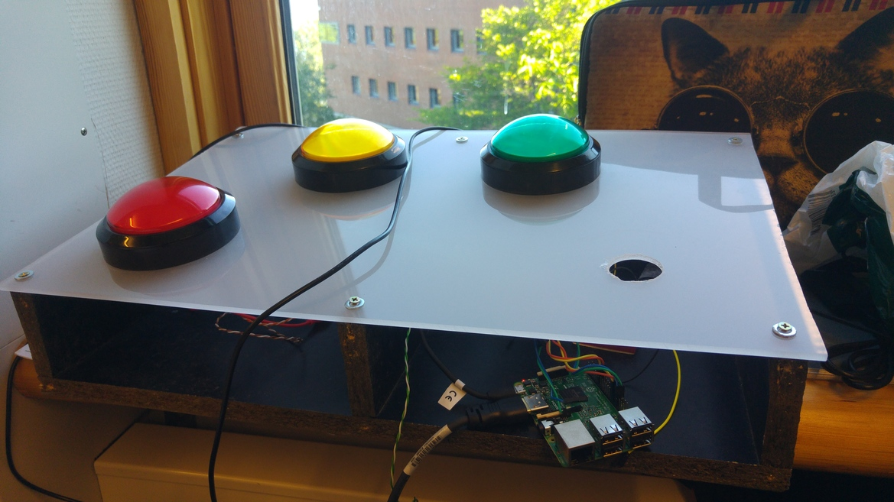
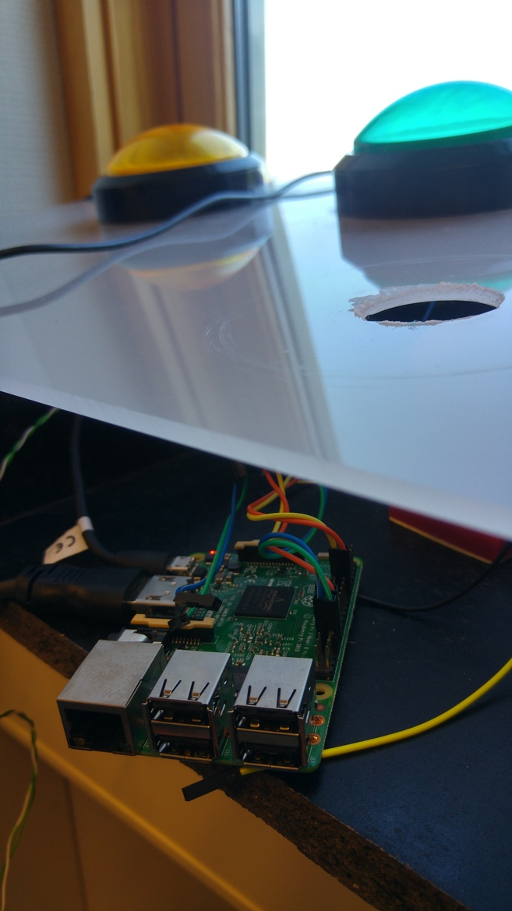

# Raspberry Pi "happymeter" written in Go

Uses "go-rpio" (github.com/stianeikeland/go-rpio) to listen for Pin changes and 
react to those based on which button was pressed.



## Buttons

To keep things very simple we have:
1. above (happy)
2. average (just fine)
3. below (sad / angry)

Note that the buttons are connected like this on the Raspberry Pi:
```
btn1 (above)    -> Pin 13
btn2 (average)  -> Pin 5
btn3 (below)    -> Pin 27
```

If your buttons are connected differently then you need to update the code first..



## Actions?

For each button action we want to do a HTTP post to a remote web service running an instance of "HappyEye": https://github.com/Statoil/happyeye

For Statoil users the HappyEye instance is running here: happymeter.cloudapp.net. The URL Endpoint for the service is: http://happymeter.cloudapp.net/api/storehappydocument.

You will need to start your own "HappyEye" service somewhere to be able to receive "signals" from the Happymeter.


*Also*, remember to copy the `config.yml.template` to `config.yml` and configure it by setting the correct endpoint and your tags.

## Build

Since the code needs to run on a Raspberry Pi you need to build for the ARM architecture. Typically you build on you own laptop and scp over the build binary:
```
$ GOOS=linux GOARCH=arm go build 
$ scp happymeter pi@192.168.43.201:~/happymeter/
```

Note: The IP is a typical "home network" IP. You need to use the IP / DNS of your own Raspberry Pi. A tip is to simply start a WiFi hotspot on your mobile device.


## Credits

Asbjørn A. Fellinghaug (https://github.com/asbjorn)